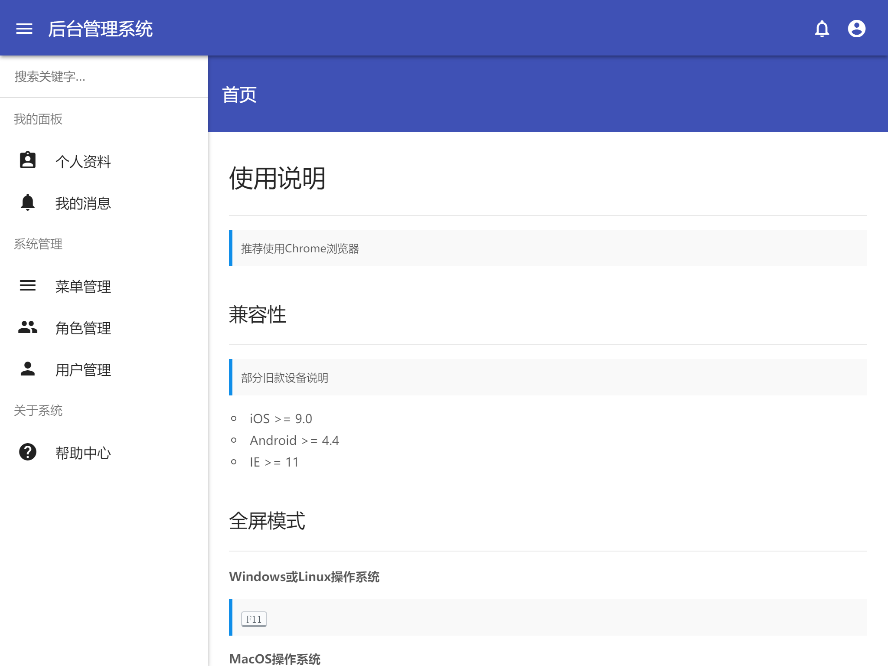
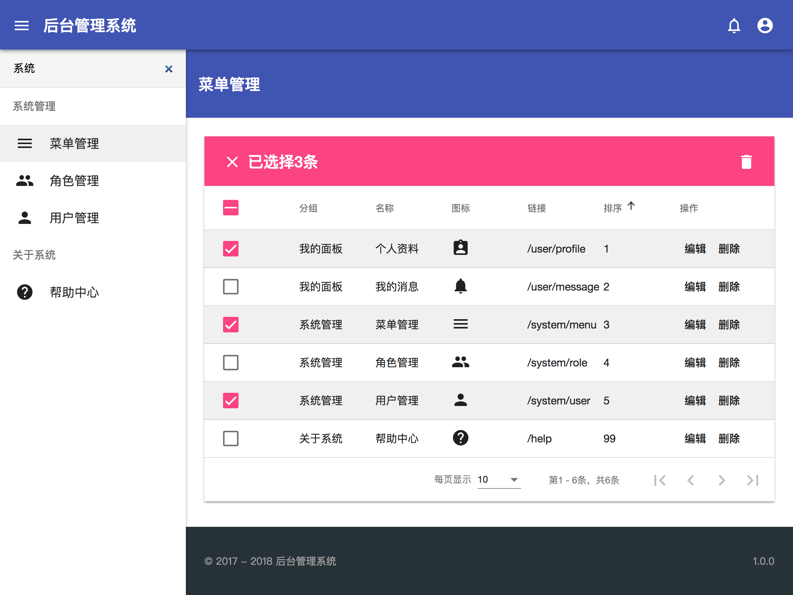

# Angular Admin

## 预览效果






## 环境配置

### docker

> 修改`/etc/docker/daemon.json`

```json
{
  "registry-mirrors": ["https://lvpmz2sk.mirror.aliyuncs.com"]
}
```

### docker-compose

> 部分linux需要单独安装 

```shell
pip install docker-compose
```

### node.js

> npm加速

```shell
npm config set registry https://registry.npm.taobao.org
npm config set disturl https://npm.taobao.org/dist
```

> node-sass加速

- windows(环境变量)
   - 变量名(N): `SASS_BINARY_SITE`
   - 变量值(V): `https://npm.taobao.org/mirrors/node-sass/`
- linux或mac
   - `echo 'sass_binary_site=https://npm.taobao.org/mirrors/node-sass/' >> ~/.npmrc`

## 代码部署

**初始化命令**

```shell
# 启动
docker-compose up -d

# 升级
docker-compose up -d --build
```

**常用命令**

> docker环境命令格式`docker-compose exec server npm run setup`

```shell
npm run setup   # 初始化数据
npm run build   # 编译静态文件
npm run watch   # 本地调试模式
```

## 备份还原

```
# 备份还原
npm run backup
npm run restore

# 单独web
npm run backup -- web
npm run restore -- web

# 单独mongo
npm run backup -- mongo
npm run restore -- mongo
```

## dashboard密码生成

> 在线生成工具： https://bcrypt-generator.com
