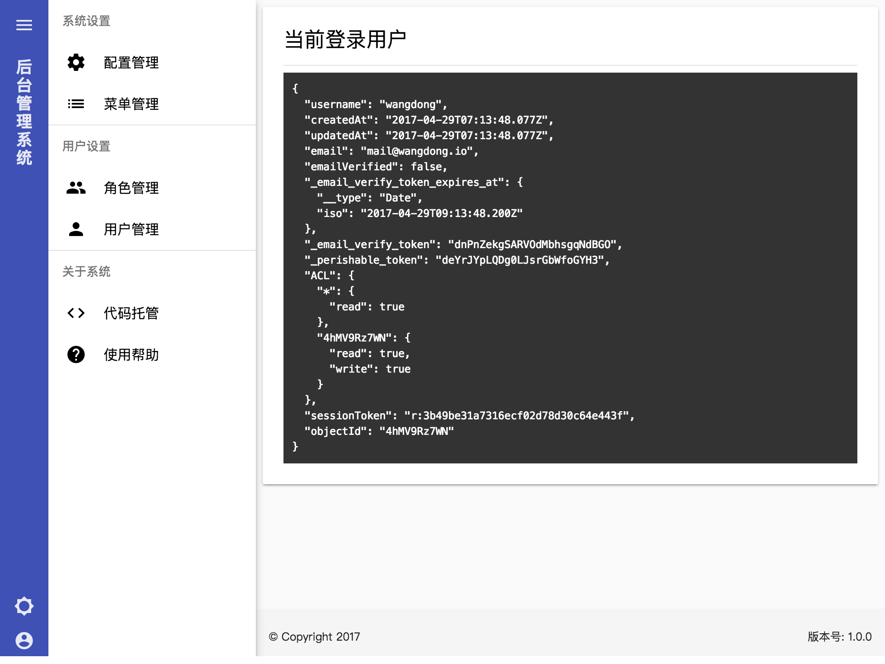
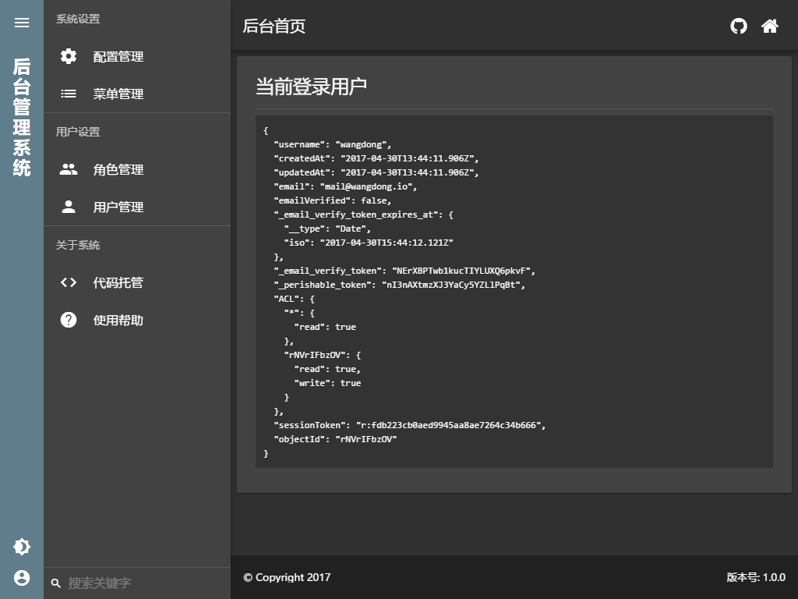

# 后台管理系统

This project was generated with [Angular CLI](https://github.com/angular/angular-cli) version 1.1.0.

## Screenshot




## Progress

- [x] 二维码组件
- [x] markdown组件
- [x] echarts组件
- [x] 图片预览组件
- [ ] 移除@covalent/core模块
- [ ] 用户管理功能
- [ ] 角色管理功能
- [ ] 配置管理功能
- [ ] 菜单管理功能

## Development server

Run `ng serve` for a dev server. Navigate to `http://localhost:4200/`. The app will automatically reload if you change any of the source files.

## Code scaffolding

Run `ng generate component component-name` to generate a new component. You can also use `ng generate directive|pipe|service|class|module`.

## Build

Run `ng build` to build the project. The build artifacts will be stored in the `dist/` directory. Use the `-prod` flag for a production build.

## Running unit tests

Run `ng test` to execute the unit tests via [Karma](https://karma-runner.github.io).

## Running end-to-end tests

Run `ng e2e` to execute the end-to-end tests via [Protractor](http://www.protractortest.org/).
Before running the tests make sure you are serving the app via `ng serve`.

## Further help

To get more help on the Angular CLI use `ng help` or go check out the [Angular CLI README](https://github.com/angular/angular-cli/blob/master/README.md).

## Nginx rewrite

```
server {
    listen       80;
    server_name  admin.dev;
    root         /var/www/html/admin/dist;

    location / {
        index  index.html index.htm;
        try_files $uri $uri/ /index.html$is_args$args;
    }
}
```
